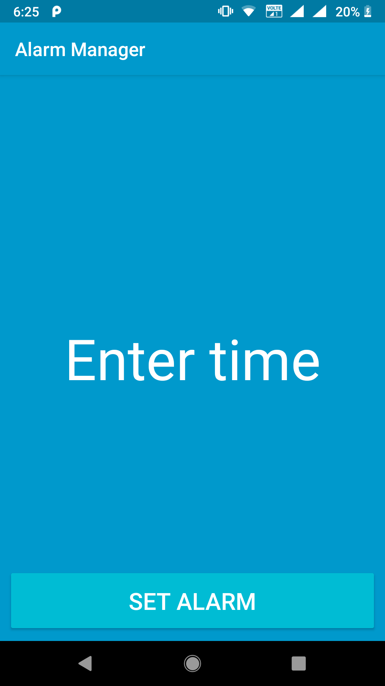

# Alarm Manager

A simple app to see what all scenarios should be considered when using Alarm manager in Android.

This is a sample app for the following blog post

[link](https://medium.com/android-news/using-alarmmanager-like-a-pro-20f89f4ca720)

other:

[developer.android](https://developer.android.com/training/scheduling/alarms)

[medium](https://medium.com/@igordias/android-scheduling-alarms-with-precise-delivery-time-using-alarmmanager-75c409f3bde0)

[dontkillmyapp](https://dontkillmyapp.com/)

## Screenshots

